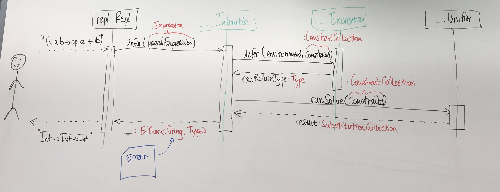

# Sensibilisation à la recherche

Le projet est une implémentation de l'algorithme d'inférence de type de Hindley Milner en Java.

Ce travail se base sur une analyse du chapitre 7 "Hindley-Milner Inference" de [Write you a haskell](http://dev.stephendiehl.com/fun/006_hindley_milner.html).

## Auteurs

- Anaël CHARDAN
- Clément GARBAY
- Damien RAYMOND

## Logs

L'ensemble des logs des différentes sessions et réunions est disponible [ici](https://github.com/anaelChardan/IMT-Recherche/blob/master/LOGS.md).

## REPL

### Commandes

- Pour quitter `:q`
- Pour afficher l'aide `:h`
- Pour activer/désactiver les informations des étapes d'inférence et d'unification `:log`

## Grammaire
Dans l'objectif de réaliser un parseur pour un REPL, nous avons créé un grammaire BNF qui représente le langage pour lequel nous validons le type.

```
<BasicExpression> ::=
    <Identifier> | <Literal> | <Application> | <Lambda> | <Let> | <BinaryExpression> | <If>

<Expression> ::=
    <BasicExpression> | '(' <BasicExpression> ')'

<ArithmeticOperator> ::=
    '+' | '-' | '*' | '/'

<ArithmeticOperation> ::=
    'op' <Expression> <ArithmeticOperator> <Expression>

<EqualityOperator> ::=
    '=='

<Condition> ::=
    'con' <Expression> <EqualityOperator> <Expression>

<BinaryExpression> ::=
    <ArithmeticOperation> | <Condition>

<If> ::=
    'if' <Condition> 'then' <Expression> 'else' <Expression>

<Application> ::=
    'app' <Expression> <Expression>
    
<Lambda> ::= 
    '\' (<Identifier>)+ '->' <Expression>
    
<Let> ::= 
    'let' <Identifier> '=' <Expression> 'in' <Expression>
    
<Literal> ::= 
    <BoolLiteral> | <IntLiteral> 
    
<BoolLiteral> ::= 
    'True' | 'False'

<IntLiteral> ::= 
    ('1'..'9')('0'..'9')+
    
<Identifier> ::= 
    ('a'..'z' | 'A'..'Z')('a'..'z' | 'A'..'Z' | '0'..'9')*
``` 

Voici un exemple d'expression qui peut être analysée :
```
let f = (\x -> x) in (app (app (\a b -> b) (app f True)) (app f 1))

    f => Identifier
    
    (\x -> x) => Expression
        \x -> x => Lambda
            x => Identifier
            x => Identifier
            
    app (app (\a b -> b) (app f True)) (app f 1) => Application
        app (\a b -> b) (app f True) => Application
            (\a b -> b) => Expression
                \a b -> b => Lambda
                    a => Identifier
                    b => Identifier
                    b => Identifier
            (app f True) => Expression
                f True => Application
                    f => Identifier
                    True => BoolLiteral
               
        (app f 1) => Expression
            app f 1 => Application
                f => Identifier
                1 => IntLiteral
        
    
```

## Organisation

Nous avons donc dans l'organisation :

- fr.imt
    - inference
        - ast
        - errors
        - type
    - logger
    - parser

### fr.imt.inference

Un package `inference` qui contient toute la logique de l'inférence de type.

#### fr.imt.inference.ast

On peut retrouver un package `ast` qui lui va contenir tous les éléments qui composent une expression à savoir :


 - Application / Lambda / Let / Literal / Variable / **BinaryExpression / If**
    - Ces éléments sont inférables : retourne un type

#### fr.imt.inference.type

Ce package `type` contient tous les types qui vont pouvoir être inférés

 - ArrowType / BooleanType / Integer / Boolean / Literal / Variable
    - Ces types sont généralizable c'est-à-dire qu'ils peuvent être convertis en un autre type en fermant toutes les variables libres dans un schéma de type.
 - On retrouve aussi le Schema qui contient un type et les variables de type à partir de ses propriétés, il est capable d'instancier des nouvelles variables de types fraîches.

En dehors de ce package, on retrouve la résolution des contraintes afin de rendre le type trouvé.

 - Le type est trouvé grâce au processus d'unification, c'est à dire résoudre les contraintes en application les substitutions nécessaires.

### fr.imt.parser

Un package `parser`, qui contient tout la logique d'analyse grammaticale. En effet, nous avons intégré un parser en utilisant la bibliothèque [parsecj](https://github.com/jon-hanson/parsecj) et en définissant nos propres règles définies dans la grammaire ci-dessus.

Nous avons également implémenté un REPL qui utilise ce parser afin de pouvoir tester des expressions très rapidement et facilement.

### Note

Nous avons également utilisé [Vavr](http://www.vavr.io/) qui permet d'avoir une écriture plus *fonctionnelle* sur les collections que ce qui est proposé de base par les streams de Java.

#### Flow d'exécution de notre algorithme

Ce diagramme de séquence présente le flow d'exécution de notre algorithme :

